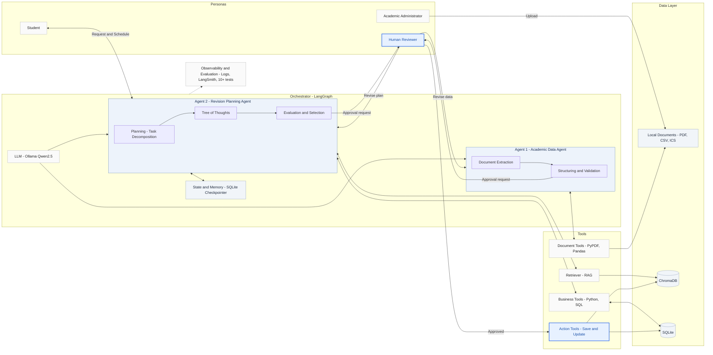

## System Architecture

The Course Planning Tutor uses a two-agent architecture
orchestrated by LangGraph, serving two personas:
academic administrators and students.

```mermaid
flowchart LR

    %% =========================
    %% PERSONAS
    %% =========================

    subgraph Users["Personas"]
        direction TB
        ADMIN["Academic Administrator"]
        STUDENT["Student"]
        HUMAN["Human Reviewer"]
    end

    %% =========================
    %% ORCHESTRATOR
    %% =========================

    subgraph ORCH["Orchestrator - LangGraph"]
        direction TB

        LLM["LLM - Ollama Qwen2.5"]

        subgraph A1["Agent 1 - Academic Data Agent"]
            direction TB
            EXTRACT["Document Extraction"]
            STRUCT["Structuring and Validation"]
            EXTRACT --> STRUCT
        end

        subgraph A2["Agent 2 - Revision Planning Agent"]
            direction TB
            PLAN["Planning - Task Decomposition"]
            TOT["Tree of Thoughts"]
            EVAL["Evaluation and Selection"]
            PLAN --> TOT --> EVAL
        end

        MEMORY["State and Memory - SQLite Checkpointer"]

        LLM --> A1
        LLM --> A2
        A2 <--> MEMORY
    end

    %% =========================
    %% TOOLS
    %% =========================

    subgraph TOOLS["Tools"]
        direction TB
        DOC["Document Tools - PyPDF, Pandas"]
        RAG["Retriever - RAG"]
        BUSINESS["Business Tools - Python, SQL"]
        ACTION["Action Tools - Save and Update"]
    end

    %% =========================
    %% DATA LAYER
    %% =========================

    subgraph DATA["Data Layer"]
        direction TB
        LOCAL["Local Documents - PDF, CSV, ICS"]
        CHROMA[(ChromaDB)]
        SQL[(SQLite)]
    end

    %% =========================
    %% USER INTERACTIONS
    %% =========================

    ADMIN -->|Upload| LOCAL
    STUDENT <-->|Request and Schedule| A2

    %% =========================
    %% TOOL CALLING
    %% =========================

    A1 <--> DOC
    DOC --> LOCAL

    A2 <--> RAG
    A2 <--> BUSINESS

    RAG --> CHROMA
    BUSINESS <--> SQL

    %% =========================
    %% HUMAN-IN-THE-LOOP
    %% =========================

    STRUCT -->|Approval request| HUMAN
    EVAL -->|Approval request| HUMAN

    HUMAN -->|Approved| ACTION
    HUMAN -->|Revise data| A1
    HUMAN -->|Revise plan| A2

    ACTION --> CHROMA
    ACTION --> SQL

    %% =========================
    %% OBSERVABILITY
    %% =========================

    OBS["Observability and Evaluation - Logs, LangSmith, 10+ tests"]

    ORCH -.-> OBS

    %% =========================
    %% STYLING
    %% =========================

    classDef agent fill:#edf3fb,stroke:#6688b3,color:#172b4d
    classDef approval fill:#e7f1ff,stroke:#2563eb,stroke-width:2px,color:#174ea6
    classDef storage fill:#f1f5f9,stroke:#94a3b8,color:#1e293b
    classDef neutral fill:#fafafa,stroke:#b8b8b8,color:#222

    class A1,A2 agent
    class HUMAN,ACTION approval
    class LOCAL,CHROMA,SQL,MEMORY storage
    class ADMIN,STUDENT,LLM,DOC,RAG,BUSINESS,OBS neutral
```
